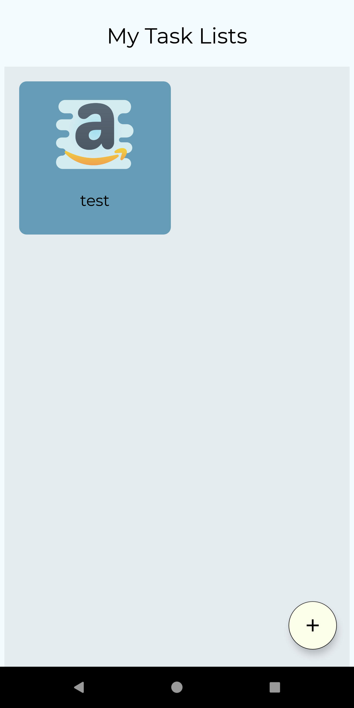

# Routine App

All in one Productivity App


## Open Doucmentation

### Donwload the file

```cmd
git clone https://github.com/AppDevIn/Routine.git
```


### Go to the Routine folder

```
cd path/to/ Routine
```


### Open the Document

```
open Documentation/index.html
```


## Team Members

1. Jeyavishnu, S10192836C
2. 


## Description of app


## Roles and contributions of each member

### Jeyavishnu

1. FCM.java

2. DeleteSectionWorker.java

3. DeleteTaskWorker

4. UploadSectionWorker

5. UploadTaskWorker

6. UploadDataWorker

7. HomeItemTouchHelperAdapter

8. HomePageAdapter

9. MyHomeItemTouchHelper

10. MySpinnerColorAdapter

11. MySpinnerIconsAdapter

12. MySpinnerIconsAdapter

13. MyTaskTouchHelper

14. OnSectionListener

15. TaskTouchHelperAdapter

16. TaskAdapter

17. Section.java

18. SectionDBHelper

19. UserDBHelper

20. TaskDBHelper

21. DBHelper

    

### Quan Sheng and Jeya

1. User.java


## Strory Mapping 


## Class Diagram 


## ER Diagram


## Screenshots


### Login 


### Register 


### Home





#### Task

