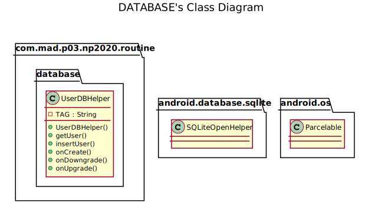
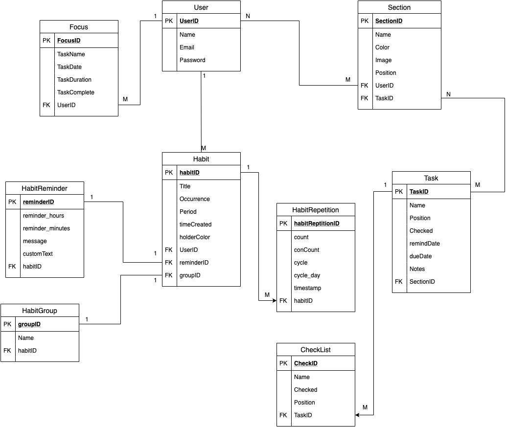
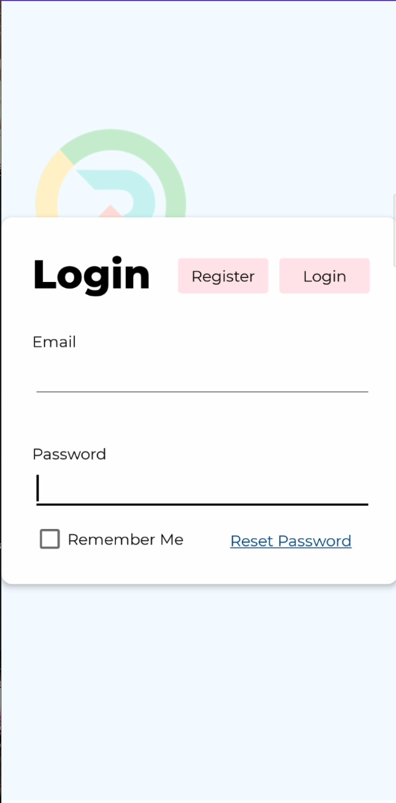
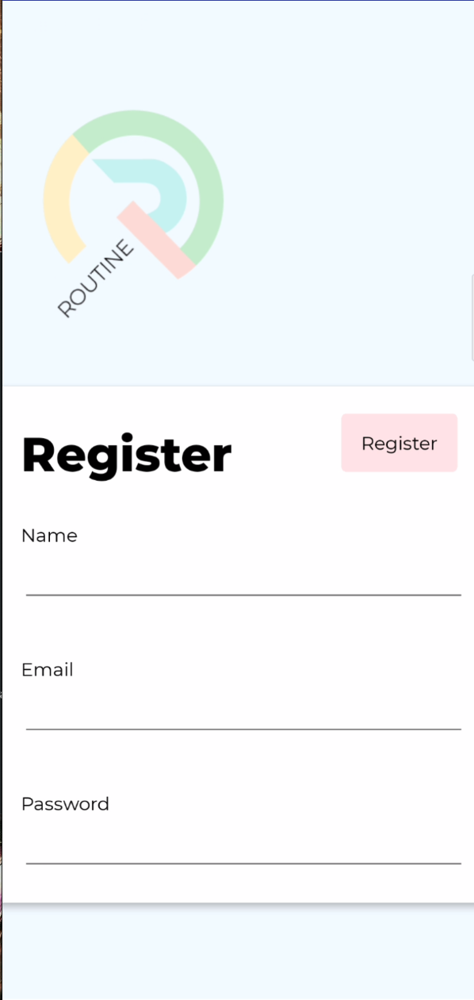
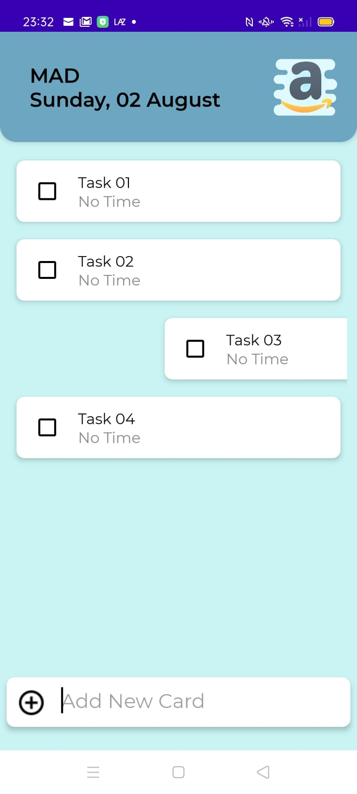
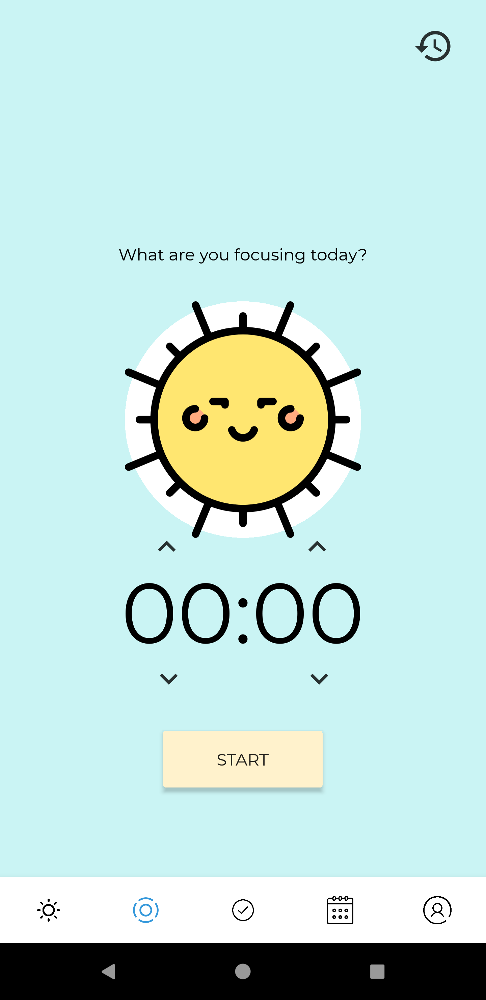
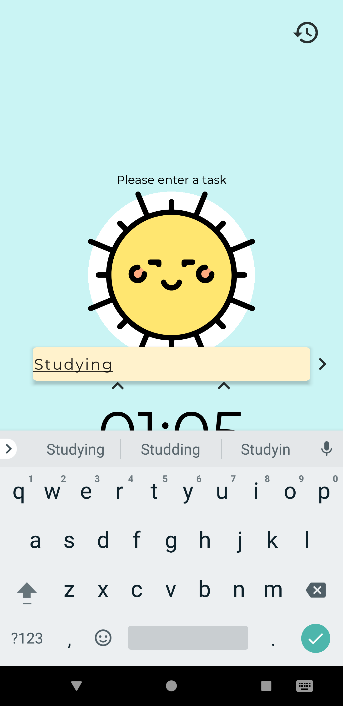
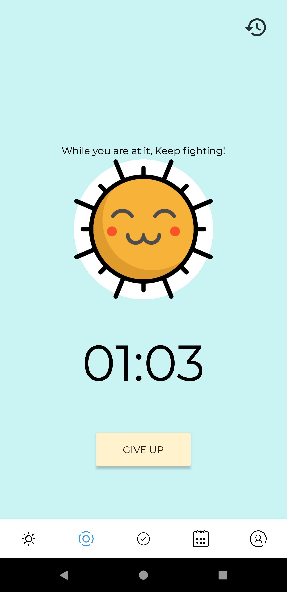
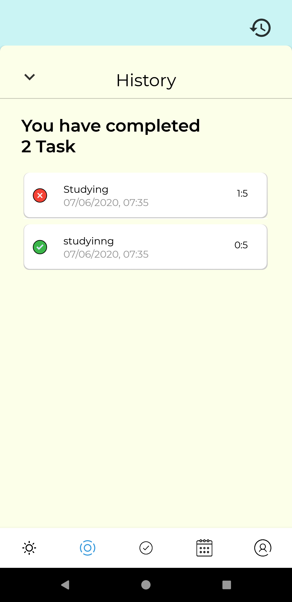

# Routine App

All in one Productivity App

## Open Doucmentation

[Routine Class Documentation](https://appdevin.github.io/routine.documentation.github.io)

## Team Members

1. Jeyavishnu, S10192836C
2. Lee Quan sheng, S10198298G
3. Pritheev, S10193030K
4. Wai Hou Man, S10197636F

## Description of app
Routine is an all-in-one app consisting of many popular productivity features integrated into one appication to give our users the convenience of not having to use multiple apps for the different features. With many modern productivity tools being designed for computer use, application versions of the tools are not optimised for use in mobile phones. As everyone always has a handphone with them all thye time, we felt that designing a productivity tool optimised for mobile use would allow users to be more efficient in carrying out tasks. Thus, we set out to solve the problem and Routine was created.

## Roles and contributions of each member

### Jeyavishnu

1. [FCMSection.java](app/src/main/java/com/mad/p03/np2020/routine/background/FCMSection.java)

2. [DeleteSectionWorker.java](app/src/main/java/com/mad/p03/np2020/routine/background/DeleteSectionWorker.java)

3. [DeleteTaskWorker.java](app/src/main/java/com/mad/p03/np2020/routine/background/DeleteTaskWorker.java)

4. [UploadSectionWorker.java]((app/src/main/java/com/mad/p03/np2020/routine/background/UploadSectionWorker.java))

5. [UploadTaskWorker.java](com/mad/p03/np2020/routine/background/UploadTaskWorker.java)

6. [UploadDataWorker.java]((app/src/main/java/com/mad/p03/np2020/routine/background/UploadDataWorker.java))

7. [HomeItemTouchHelperAdapter.java]((app/src/main/java/com/mad/p03/np2020/routine/Interface/HomeItemTouchHelperAdapter.java))

8. [HomePageAdapter.java](app/src/main/java/com/mad/p03/np2020/routine/Adapter/HomePageAdapter.java)

9. [MyHomeItemTouchHelper.java](app/src/main/java/com/mad/p03/np2020/routine/Adapter/MyHomeItemTouchHelper.java)

10. [MySpinnerColorAdapter.java](app/src/main/java/com/mad/p03/np2020/routine/Adapter/MySpinnerColorAdapter.java)

11. [MySpinnerIconsAdapter.java](app/src/main/java/com/mad/p03/np2020/routine/Adapter/MySpinnerIconsAdapter.java)

13. [MyTaskTouchHelper.java]((app/src/main/java/com/mad/p03/np2020/routine/Adapter/MyTaskTouchHelper.java))

15. [TaskTouchHelperAdapter.java](com/mad/p03/np2020/routine/Interface/TaskTouchHelperAdapter.java)

16. [TaskAdapter.java](app/src/main/java/com/mad/p03/np2020/routine/Adapter/TaskAdapter.java)

18. [SectionDBHelper.java](app/src/main/java/com/mad/p03/np2020/routine/database/SectionDBHelper.java)

19. [UserDBHelper.java]((app/src/main/java/com/mad/p03/np2020/routine/database/UserDBHelper.java))

20. [TaskDBHelper.java]((app/src/main/java/com/mad/p03/np2020/routine/database/TaskDBHelper.java))

21. [DBHelper.java](app/src/main/java/com/mad/p03/np2020/routine/database/DBHelper.java)

22. [MyHomeViewHolder.java](app/src/main/java/com/mad/p03/np2020/routine/ViewHolder/TaskViewHolder.java)

23. [TaskViewHolder.java](app/src/main/java/com/mad/p03/np2020/routine/ViewHolder/MyHomeViewHolder.java)

24. [Task.java](app/src/main/java/com/mad/p03/np2020/routine/Class/Section.java)

24. [Section.java](app/src/main/java/com/mad/p03/np2020/routine/Class/Task.java)

25. [TaskActivity.java](app/src/main/java/com/mad/p03/np2020/routine/TaskActivity.java)

26. [Home.java](app/src/main/java/com/mad/p03/np2020/routine/Home.java)

25. [GetTaskSectionWorker.java](app/src/main/java/com/mad/p03/np2020/routine/background/GetTaskSectionWorker.java)

26. [MyDatabaseListener.java](com/mad/p03/np2020/routine/Interface/MyDatabaseListener.java)

27. [OnFirebaseAuth.java](app/src/main/java/com/mad/p03/np2020/routine/Interface/OnFirebaseAuth.java)

   

### Quan Sheng and Jeya

1. [User.java](app/src/main/java/com/mad/p03/np2020/routine/Class/User.java)

### Lee Quan Sheng

1. [FocusAdapter.java](app/src/main/java/com/mad/p03/np2020/routine/Adapter/FocusAdapter.java)

2. [FocusWorker.java](app/src/main/java/com/mad/p03/np2020/routine/background/FocusWorker.java)

3. [Focus.java](app/src/main/java/com/mad/p03/np2020/routine/Class/Focus.java)

4. [ItemDecoration.java](app/src/main/java/com/mad/p03/np2020/routine/Class/ItemDecoration.java)

5. [FocusDBHelper.java](app/src/main/java/com/mad/p03/np2020/routine/database/FocusDBHelper.java)

6. [FocusActivity.java](app/src/main/java/com/mad/p03/np2020/routine/FocusActivity.java)

7. [LoginActivity.java](app/src/main/java/com/mad/p03/np2020/routine/LoginActivity.java)

8. [HistoryFragment.java](app/src/main/java/com/mad/p03/np2020/routine/HistoryFragment.java)

9. [FocusViewHolder.java](app/src/main/java/com/mad/p03/np2020/routine/ViewHolder/FocusViewHolder.java)

10. [BoundService.java](app/src/main/java/com/mad/p03/np2020/routine/Class/BoundService.java)

   ​    

### Wai Hou Man

1. [HabitAdapter.java](app/src/main/java/com/mad/p03/np2020/routine/Adapter/HabitAdapter.java)

2. [HabitGroupAdapter.java](app/src/main/java/com/mad/p03/np2020/routine/Adapter/HabitGroupAdapter.java)

3. [OnItemClickListener.java](app/src/main/java/com/mad/p03/np2020/routine/Interface/OnItemClickListener.java)

4. [HabitWorker.java](app/src/main/java/com/mad/p03/np2020/routine/background/HabitWorker.java)

5. [HabitGroupWorker.java](app/src/main/java/com/mad/p03/np2020/routine/background/HabitGroupWorker.java)

6. [Habit.java](app/src/main/java/com/mad/p03/np2020/routine/Class/Habit.java)

7. [HabitGroup.java](app/src/main/java/com/mad/p03/np2020/routine/Class/HabitGroup.java)

8. [HabitReminder.java](app/src/main/java/com/mad/p03/np2020/routine/Class/HabitReminder.java)

9. [HabitDBHelper.java](app/src/main/java/com/mad/p03/np2020/routine/database/HabitDBHelper.java)

10. [HabitGroupDBHelper.java](app/src/main/java/com/mad/p03/np2020/routine/database/HabitGroupDBHelper.java)

11. [HabitHolder.java](app/src/main/java/com/mad/p03/np2020/routine/ViewHolder/HabitHolder.java)

12. [HabitGroupHolder.java](app/src/main/java/com/mad/p03/np2020/routine/ViewHolder/HabitGroupHolder.java)

13. [HabitActivity.java](app/src/main/java/com/mad/p03/np2020/routine/HabitActivity.java)

14. [HabitAddActivity.java](app/src/main/java/com/mad/p03/np2020/routine/HabitAddActivity.java)

15. [HabitEditActivity.java](app/src/main/java/com/mad/p03/np2020/routine/HabitEditActivity.java)

16. [HabitGroupActivity.java](app/src/main/java/com/mad/p03/np2020/routine/HabitGroupActivity.java)

17. [HabitReminderActivity.java](app/src/main/java/com/mad/p03/np2020/routine/HabitReminderActivity.java)

18. [HabitViewActivity.java](app/src/main/java/com/mad/p03/np2020/routine/HabitViewActivity.java)
   ​    

### Pritheev Roshan

1.[CardActivity.java](app/src/main/java/com/mad/p03/np2020/routine/Class/CardActivity.java)

2.[PopUp.java](app/src/main/java/com/mad/p03/np2020/routine/Class/PopUp.java)

3.[CardAdapter.java](app/src/main/java/com/mad/p03/np2020/routine/Adapter/CardAdapter.java)

4.[CardViewHolder.java](app/src/main/java/com/mad/p03/np2020/routine/Class/CardViewHolder.java)

5.[CardNotification.java](app/src/main/java/com/mad/p03/np2020/routine/Class/CardNotification.java)

6.[NotesFragment.java](app/src/main/java/com/mad/p03/np2020/routine/Class/NotesFragment.java)

7.[StepsFragment.java](app/src/main/java/com/mad/p03/np2020/routine/Class/StepsFragment.java)

8.[Settings.java](app/src/main/java/com/mad/p03/np2020/routine/Class/Settings.java)

## Story Mapping 

## Class Diagram 

## ER Diagram

## Screenshots

### Login 

1. Type in your email and password and click on the login button
2. Click on the register button to register

### Register 

1. Enter the name should not be empty
2. Enter Email with @ and .com
3. Enter password must have alpha numeric, special and length og 8
4. Press register to create account in firebase

#### Home

|  |  |  |
| ------------------------------------------------------------ | ------------------------------------------------------------ | ------------------------------------------------------------ |
| **Press the floating button to add task**                    | **Press and hold to move**                                   | **Swipe to the end of the screen to delete**                 |

### Task

|  |  |  |
| ------------------------------------------------------------ | ------------------------------------------------------------ | ----------------------------------------------------------- |
| **Swipe to right to delete**                                 | **Press and hold to move**                                   | **Clicked on the textbox to add task**                      |

#### Task Info

|  |   |  |  |
| ---------------------------------------------------- | ----------------------------------------------------- | :----------------------------------------------------: | ---------------------------------------------------- |
| **Click the circle button to add notes**             | **Click the circle button and bell icon to add time** |   **Click the circle button  and text to add date**    | **Chose the data to add the date**                   |

#### Habit Tracker

Functionality: Helps to keep track of your habits on a period goal basis.

This shows your today's habits.

|  |  |  |
| ------------------------------------------------------------ | ------------------------------------------------------------ | ------------------------------------------------------------   |
| **Press the add button on the habit to check in**            | **Press the floating button to add habit**                   | **Press on the habit to view the habit**                 |

|  |  |  |
| ------------------------------------------------------------ | ------------------------------------------------------------ | ------------------------------------------------------------   |
| **Press the add or "reset" button to respectively add or decrease the count by 1 on the habit view**    | **Click on the number sign to modify habit count  on the habit view**                  | **Press the delete button on the habit view to delete the habit**                 |

|  |  |  |
| ------------------------------------------------------------ | ------------------------------------------------------------ | ------------------------------------------------------------   |
| **Click on the modify button on the habit view to edit the habit**            | **Press the reminder indicate text to add a reminder**                   | **Turn the time picker to choose the reminder time**                 |

|  |  |  |
| ------------------------------------------------------------ | ------------------------------------------------------------ | ------------------------------------------------------------   |
| **Click on the modify button on the habit view to edit the habit**            | **Press the reminder indicate text to add a reminder**                   | **Turn the time picker to choose the reminder time**                 |

|  |  |  |
| ------------------------------------------------------------ | ------------------------------------------------------------ | ------------------------------------------------------------   |
| **Click on the group indicate text to assign a group to the habit**            | **Press the "create group" button to create a group**                   | **Press the "cancel" button to delete a group**                 |

#### Focus

|  |   | |  |
| ---------------------------------------------------- | ----------------------------------------------------- | :----------------------------------------------------: | ---------------------------------------------------- |
| **Click the timer button to set timer**             | **Set Task Input to set timer** |   **Your Focus has started** | **Click recent icon to View Focus History** |

