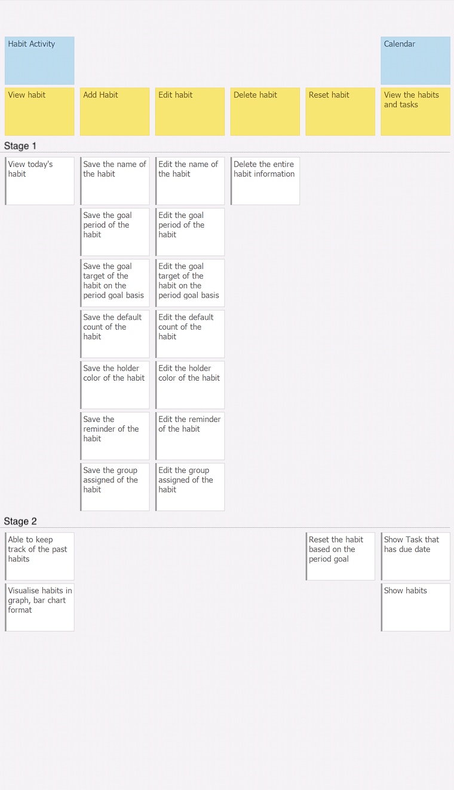
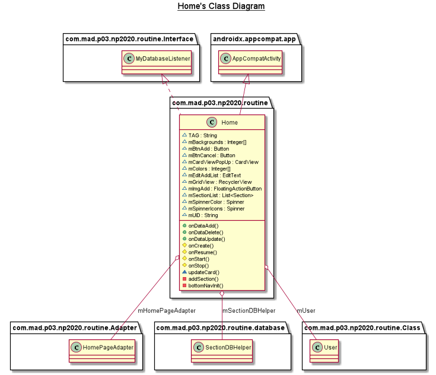
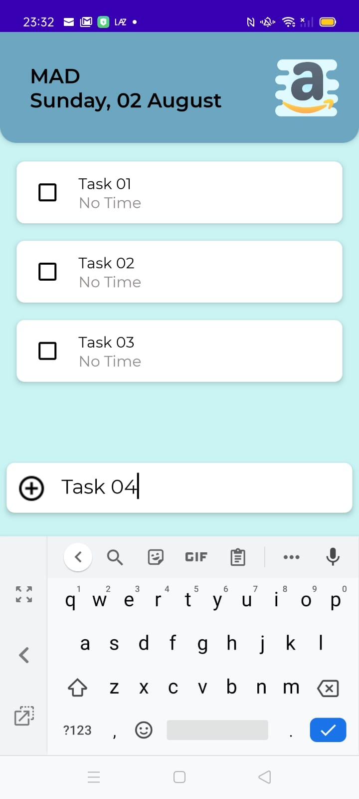
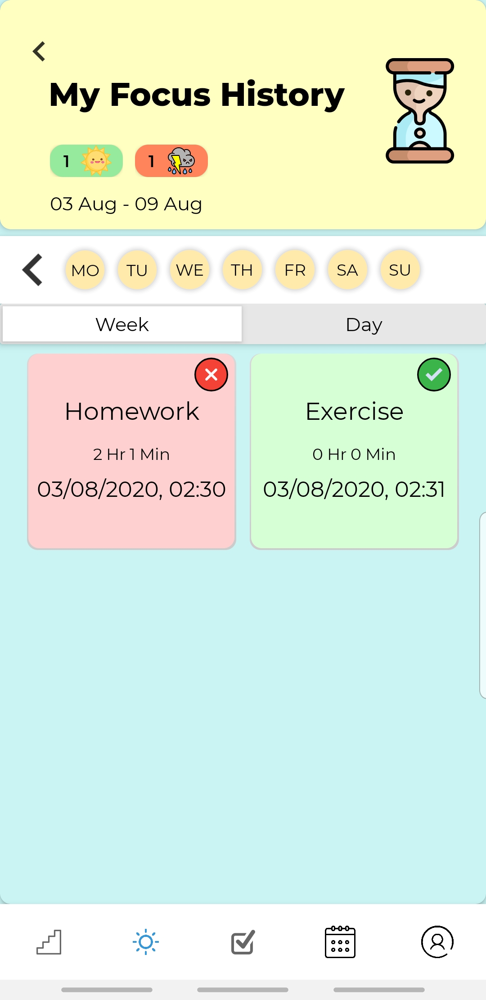
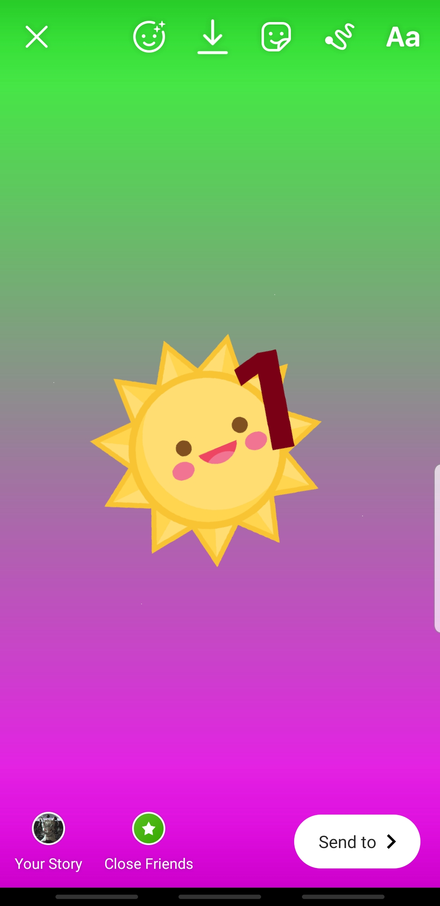

# Routine App

All in one Productivity App

## Open Doucmentation

[Routine Class Documentation](https://appdevin.github.io/routine.documention/)

## Team Members

1. Jeyavishnu, S10192836C 
2. Lee Quan sheng, S10198298G
3. Pritheev, S10193030K
4. Wai Hou Man, S10197636F

## Description of app
Routine is an all-in-one app consisting of many popular productivity features integrated into one appication to give our users the convenience of not having to use multiple apps for the different features. With many modern productivity tools being designed for computer use, application versions of the tools are not optimised for use in mobile phones. As everyone always has a handphone with them all thye time, we felt that designing a productivity tool optimised for mobile use would allow users to be more efficient in carrying out tasks. Thus, we set out to solve the problem and Routine was created.

## Roles and contributions of each member

1. Jeyavishnuu (Project Manager and Feature Developer)

2. Lee Quan Sheng (UX/UI Designer and Feature Developer)

2. Wai Hou Man (Project Planner and Feature Developer)

4. Pritheev Roshan (UX/UI Designer and Feature Developer)

### Jeyavishnu

1. [FCMSection.java](app/src/main/java/com/mad/p03/np2020/routine/background/FCMSection.java)

2. [DeleteSectionWorker.java](app/src/main/java/com/mad/p03/np2020/routine/background/DeleteSectionWorker.java)

3. [DeleteTaskWorker.java](app/src/main/java/com/mad/p03/np2020/routine/Task/model/DeleteTaskWorker.java)

4. [UploadSectionWorker.java](app/src/main/java/com/mad/p03/np2020/routine/Home/models/UploadSectionWorker.java)

5. [UploadTaskWorker.java](app/src/main/java/com/mad/p03/np2020/routine/Task/model/UploadTaskWorker.java)

6. [UploadDataWorker.java](app/src/main/java/com/mad/p03/np2020/routine/background/UploadDataWorker.java)

7. [HomeItemTouchHelperAdapter.java](app/src/main/java/com/mad/p03/np2020/routine/Home/models/HomeItemTouchHelperAdapter.java))

8. [HomePageAdapter.java](app/src/main/java/com/mad/p03/np2020/routine/Home/adapters/HomePageAdapter.java)

9. [MyHomeItemTouchHelper.java](app/src/main/java/com/mad/p03/np2020/routine/Home/models/MyHomeItemTouchHelper.java)

10. [MySpinnerColorAdapter.java](app/src/main/java/com/mad/p03/np2020/routine/Home/adapters/MySpinnerColorAdapter.java)

11. [MySpinnerIconsAdapter.java](app/src/main/java/com/mad/p03/np2020/routine/Home/adapters/MySpinnerIconsAdapter.java)

13. [MyTaskTouchHelper.java](app/src/main/java/com/mad/p03/np2020/routine/Task/model/MyTaskTouchHelper.java)

15. [TaskTouchHelperAdapter.java](app/src/main/java/com/mad/p03/np2020/routine/Task/model/TaskTouchHelperAdapter.java)

16. [TaskAdapter.java](app/src/main/java/com/mad/p03/np2020/routine/Task/adapter/TaskAdapter.java)

17. [SectionDBHelper.java](app/src/main/java/com/mad/p03/np2020/routine/DAL/SectionDBHelper.java)

18. [UserDBHelper.java](app/src/main/java/com/mad/p03/np2020/routine/DAL/UserDBHelper.java)

19. [TaskDBHelper.java](app/src/main/java/com/mad/p03/np2020/routine/DAL/TaskDBHelper.java)

20. [DBHelper.java](app/src/main/java/com/mad/p03/np2020/routine/DAL/DBHelper.java)

21. [MyHomeViewHolder.java](app/src/main/java/com/mad/p03/np2020/routine/Home/ViewHolder/MyHomeViewHolder.java)

22. [TaskViewHolder.java](app/src/main/java/com/mad/p03/np2020/routine/Task/ViewHolder/TaskViewHolder.java)

23. [Task.java](app/src/main/java/com/mad/p03/np2020/routine/models/Section.java)

24. [Section.java](app/src/main/java/com/mad/p03/np2020/routine/models/Task.java)

25. [TaskActivity.java](app/src/main/java/com/mad/p03/np2020/routine/Task/TaskActivity.java)

26. [Home.java](app/src/main/java/com/mad/p03/np2020/routine/Home/Home.java)

25. [GetTaskSectionWorker.java](app/src/main/java/com/mad/p03/np2020/routine/helpers/GetTaskSectionWorker.java)

26. [MyDatabaseListener.java](app/src/main/java/com/mad/p03/np2020/routine/helpers/MyDatabaseListener.java)

27. [OnFirebaseAuth.java](app/src/main/java/com/mad/p03/np2020/routine/Register/models/OnFirebaseAuth.java)

28. [Calender](app/src/main/java/com/mad/p03/np2020/routine/Calender/Calender.java)

29. [CustomCalenderView](app/src/main/java/com/mad/p03/np2020/routine/Calender/CustomCalender/CustomCalenderView.java)

30. [DateChangeListener](app/src/main/java/com/mad/p03/np2020/routine/Calender/CustomCalender/DateChangeListener.java)

31. [GridViewAdapter](app/src/main/java/com/mad/p03/np2020/routine/Calender/CustomCalender/GridViewAdapter.java)

32. [NotesFragment.java](app/src/main/java/com/mad/p03/np2020/routine/Card/Fragments/NotesFragment.java)

33. [CheckAdapter](app/src/main/java/com/mad/p03/np2020/routine/Card/adapters/CheckAdapter.java)

34. [CardTouchHelperAdapter](app/src/main/java/com/mad/p03/np2020/routine/Card/models/CardTouchHelperAdapter.java)

35. [MyCheckViewHolder](app/src/main/java/com/mad/p03/np2020/routine/Card/ViewHolder/MyCheckViewHolder.java)

36. [TaskSettings](app/src/main/java/com/mad/p03/np2020/routine/Task/Fragment/TaskSettings.java)

37. [GetTeamWorker](app/src/main/java/com/mad/p03/np2020/routine/Task/model/GetTeamWorker.java)

38. [TeamDataListener](app/src/main/java/com/mad/p03/np2020/routine/Task/model/TeamDataListener.java)

39. [UploadTeamWorker](app/src/main/java/com/mad/p03/np2020/routine/Task/model/UploadTeamWorker.java)

40. [TeamViewHolder](app/src/main/java/com/mad/p03/np2020/routine/Task/ViewHolder/TeamViewHolder.java)

    ​     

### Quan Sheng and Jeya

1. [User.java](app/src/main/java/com/mad/p03/np2020/routine/Class/User.java)

### Lee Quan Sheng

1. [FocusAdapter.java](app/src/main/java/com/mad/p03/np2020/routine/Focus/Adapter/FocusAdapter.java)

2. [AchievementAdapter.java](app/src/main/java/com/mad/p03/np2020/routine/Focus/Adapter/AchievementAdapter.java)

3. [GridViewAdapterAchievements.java](app/src/main/java/com/mad/p03/np2020/routine/Focus/Adapter/GridViewAdapterAchievements.java)

4. [AchievementDBHelper.java](app/src/main/java/com/mad/p03/np2020/routine/Focus/DAL/AchievementDBHelper.java)

5. [FocusDBHelper.java](app/src/main/java/com/mad/p03/np2020/routine/Focus/DAL/FocusDBHelper.java)

6. [AchievementFragment.java](app/src/main/java/com/mad/p03/np2020/routine/Focus/Fragment/AchievementFragment.java)

7. [HistoryFragment.java](app/src/main/java/com/mad/p03/np2020/routine/Focus/Fragment/HistoryFragment.java)

8. [FocusDBObservable.java](app/src/main/java/com/mad/p03/np2020/routine/Focus/Fragment/FocusDBObservable.java)

9. [FocusDBObserver.java](app/src/main/java/com/mad/p03/np2020/routine/Focus/Fragment/FocusDBObserver.java)

10. [Achievement.java](app/src/main/java/com/mad/p03/np2020/routine/Focus/Model/Achievement.java)

11. [Focus.java](app/src/main/java/com/mad/p03/np2020/routine/Focus/Model/Focus.java)

12. [ItemDecoration.java](app/src/main/java/com/mad/p03/np2020/routine/Focus/Model/ItemDecoration.java)

13. [ResizeableButton.java](app/src/main/java/com/mad/p03/np2020/routine/Focus/Model/ResizeableButton.java)

14. [AchievementViewHolder.java](app/src/main/java/com/mad/p03/np2020/routine/Focus/ViewHolder/AchievementViewHolder.java)

15. [FocusViewHolder.java](app/src/main/java/com/mad/p03/np2020/routine/Focus/ViewHolder/FocusViewHolder.java)

16. [ItemAchievementViewHolder.java](app/src/main/java/com/mad/p03/np2020/routine/Focus/ViewHolder/ItemAchievementViewHolder.java)

17. [FocusActivity.java](app/src/main/java/com/mad/p03/np2020/routine/Focus/FocusActivity.java)

18. [BoundService.java](app/src/main/java/com/mad/p03/np2020/routine/background/BoundService.java)

19. [FocusWorker.java](app/src/main/java/com/mad/p03/np2020/routine/background/FocusWorker.java)

20. [GetAchievementWorker.java](app/src/main/java/com/mad/p03/np2020/routine/background/GetAchievementWorker.java)

21. [LoginActivity.java](app/src/main/java/com/mad/p03/np2020/routine/LoginActivity.java)

22. [InternetStatus.java](app/src/main/java/com/mad/p03/np2020/routine/models/InternetStatus.java)

22. [CircularProgressBar.java](app/src/main/java/com/mad/p03/np2020/routine/models/CircularProgressBar.java)

### Wai Hou Man

1. [HabitWorker.java](app/src/main/java/com/mad/p03/np2020/routine/background/HabitWorker.java)

2. [HabitRepetitionWorker.java](app/src/main/java/com/mad/p03/np2020/routine/background/HabitRepetitionWorker.java)
   ​    
3. [HabitGroupWorker.java](app/src/main/java/com/mad/p03/np2020/routine/background/HabitGroupWorker.java)

4. [HabitAdapter.java](app/src/main/java/com/mad/p03/np2020/routine/Habit/Adapter/HabitAdapter.java)

5. [HabitCheckAdapter.java](app/src/main/java/com/mad/p03/np2020/routine/Habit/Adapter/HabitCheckAdapter.java)

6. [HabitGroupAdapter.java](app/src/main/java/com/mad/p03/np2020/routine/Habit/Adapter/HabitGroupAdapter.java)

7. [HabitHolder.java](app/src/main/java/com/mad/p03/np2020/routine/Habit/ViewHolder/HabitHolder.java)

8. [HabitCheckHolder.java](app/src/main/java/com/mad/p03/np2020/routine/Habit/ViewHolder/HabitCheckHolder.java)

9. [HabitGroupHolder.java](app/src/main/java/com/mad/p03/np2020/routine/Habit/ViewHolder/HabitGroupHolder.java)

10. [HabitDBHelper.java](app/src/main/java/com/mad/p03/np2020/routine/Habit/DAL/HabitDBHelper.java)

12. [HabitRepetitionDBHelper.java](app/src/main/java/com/mad/p03/np2020/routine/Habit/DAL/HabitRepetitionDBHelper.java)

12. [HabitGroupDBHelper.java](app/src/main/java/com/mad/p03/np2020/routine/Habit/DAL/HabitGroupDBHelper.java)

13. [HabitHorizontalDivider.java](app/src/main/java/com/mad/p03/np2020/routine/Habit/helpers/HabitHorizontalDivider.java)

14. [IntegerFormatter.java](app/src/main/java/com/mad/p03/np2020/routine/Habit/helpers/IntegerFormatter.java)

15. [HabitItemClickListener.java](app/src/main/java/com/mad/p03/np2020/routine/Habit/Interface/HabitItemClickListener.java)

16. [HabitCheckItemClickListener.java](app/src/main/java/com/mad/p03/np2020/routine/Habit/Interface/HabitCheckItemClickListener.java)

17. [HabitDBObservable.java](app/src/main/java/com/mad/p03/np2020/routine/Habit/Interface/HabitDBObservable.java)

18. [HabitDBObserver.java](app/src/main/java/com/mad/p03/np2020/routine/Habit/Interface/HabitDBObserver.java)

19. [AlarmReceiver.java](app/src/main/java/com/mad/p03/np2020/routine/Habit/models/AlarmReceiver.java)

20. [Habit.java](app/src/main/java/com/mad/p03/np2020/routine/Habit/models/Habit.java)

21. [HabitGroup.java](app/src/main/java/com/mad/p03/np2020/routine/Habit/models/HabitGroup.java)

22. [HabitReminder.java](app/src/main/java/com/mad/p03/np2020/routine/Habit/models/HabitReminder.java)

23. [HabitRepetition.java](app/src/main/java/com/mad/p03/np2020/routine/Habit/models/HabitRepetition.java)

24. [HabitActivity.java](app/src/main/java/com/mad/p03/np2020/routine/Habit/HabitActivity.java)

25. [HabitAddActivity.java](app/src/main/java/com/mad/p03/np2020/routine/Habit/HabitAddActivity.java)

26. [HabitEditActivity.java](app/src/main/java/com/mad/p03/np2020/routine/Habit/HabitEditActivity.java)

27. [HabitGroupActivity.java](app/src/main/java/com/mad/p03/np2020/routine/Habit/HabitGroupActivity.java)

28. [HabitReminderActivity.java](app/src/main/java/com/mad/p03/np2020/routine/Habit/HabitReminderActivity.java)

29. [HabitViewActivity.java](app/src/main/java/com/mad/p03/np2020/routine/Habit/HabitViewActivity.java)

### Pritheev Roshan

1.[CardActivity.java](app/src/main/java/com/mad/p03/np2020/routine/Card/CardActivity.java)

2.[ScheduleDialogFragment](app/src/main/java/com/mad/p03/np2020/routine/DAL/ScheduleDBHelper.java)

3.[ScheduleDBHelper](app/src/main/java/com/mad/p03/np2020/routine/Card/CardActivity.java)

4.[Schedule](app/src/main/java/com/mad/p03/np2020/routine/models/Schedule.java)

5.[ProfileActivity](app/src/main/java/com/mad/p03/np2020/routine/Profile/ProfileActivity.java)

6.[PasswordDialog](app/src/main/java/com/mad/p03/np2020/routine/Profile/Dialogs/PasswordDialog.java)

7.[ReportDialog](app/src/main/java/com/mad/p03/np2020/routine/Profile/Dialogs/ReportDialog.java)

8.[UsernameDialog](app/src/main/java/com/mad/p03/np2020/routine/Profile/Dialogs/UsernameDialog.java)

9.[CardNotification](app/src/main/java/com/mad/p03/np2020/routine/models/CardNotification.java)

10.[PopUp](app/src/main/java/com/mad/p03/np2020/routine/models/PopUp.java)

11.[CardAdapter](app/src/main/java/com/mad/p03/np2020/routine/models/CardAdapter.java)

12.[CardViewHolder](app/src/main/java/com/mad/p03/np2020/routine/models/CardViewHolder.java)

13.[StepsFragment](app/src/main/java/com/mad/p03/np2020/routine/Fragment/StepsFragment.java)

14.[NotesFragment](app/src/main/java/com/mad/p03/np2020/routine/Card/Fragment/NotesFragment.java)

15.[Settings](app/src/main/java/com/mad/p03/np2020/routine/Settings.java)

## Story Mapping 

Storymap for Account Management, Side Navigation Bar, Manage Section

Storymap for Manage Task and FocusActivity

Storymap for HabitActivity and Calendar

## Class Diagram 

Updated Class Diagram

## ER Diagram

## Screenshots

### Login 

1. Type in your email and password and click on the login button
2. Click on the register button to register

### Register 

1. Enter the name should not be empty
2. Enter Email with @ and .com
3. Enter password must have alpha numeric, special and length og 8
4. Press register to create account in firebase

#### Home

|  |  |  |
| ------------------------------------------------------------ | ------------------------------------------------------------ | ------------------------------------------------------------ |
| **Press the floating button to add task**                    | **Press and hold to move**                                   | **Swipe to the end of the screen to delete**                 |

### Task

|  |  |  |  |  |
| ------------------------------------------------ | ------------------------------------------------------ | ----------------------------------------------------------- | ------------------------------------------------------------ | --------------------------------------------------------- |
| **Swipe to right to delete**                     | **Press and hold to move**                             | **Clicked on the textbox to add task**                      | Edit task                                                    | Share with members                                        |

**My Calender**

|  |  |  |
| ------------------------------------------------------------ | ------------------------------------------------------------ | ---------------------------------------------- |
| **Press the dates text to change date**                      | Blue dot will appear if got event                            | **Shows task if the date have one**            |

#### Task Info

|  |  |  |
| ---------------------------------------------------- | ---------------------------------------------------- | :--------------------------------------- |
| **Click the notes Tab to enter notes**               | **Click the schedule text to enter time and date**   | **Click on the check list to add check** |

#### Habit Tracker

|  |  |  |  |
| ---------------------------------------------------- | ----------------------------------------------------- | :----------------------------------------------------: | ---------------------------------------------------- |
| **The upper part show all the habits in horizontal grid view. There are circular progress bar and text to indicate the habit progress.** | **The page indicator shows the page you at. Clicking on left and right arrows will redirect to previous and next page of the habits.** | **There will be a remind text to show there are how many incomplete habits.Clicking on the white habit holder to check in your habit** | **Press the floating button at the top right to add habit** |

|  |  |  |  | 
| ---------------------------------------------------- | ----------------------------------------------------- | :----------------------------------------------------: | ---------------------------------------------------- |
| **Click on the habit in horizontal grid view to go to this habit view page. This will give overview of the habit by showing your current and best streak, and also your total completion.** | **This visualise your habit data in bar chart. Click on week, month, or year button to see different bar chart based on that period. You can navigate to past data if there is any.** | **Click on the edit habit button to edit the habit**  | **Press on the delete button at the bottom of edit page to remove your habit**   

#### Focus

|  |   | |  |  |  |
| ---------------------------------------------------- | ----------------------------------------------------- | ---------------------------------------------------- | ----------------------------------------------------- | ---------------------------------------------------- | ----------------------------------------------------- | 
| **Focus Main Page** | **Set the task of the focus** | **View of completed focus time** | **View of give up focus time** | **Set your focus timer** | **View of ongoing timer** |

#### Focus History

|  |   |
| ---------------------------------------------------- | ----------------------------------------------------- | 
| **View Focus History of the week** | **View Focus History of the day** |

#### Focus Achievement

|  |   | |  |
| ---------------------------------------------------- | ----------------------------------------------------- | ---------------------------------------------------- | ----------------------------------------------------- | 

| **Focus Achievement Page** | **View the details of the unlocked badge** | **View the details of the locked badge** | **View of badge on insta story** |

### Profile
|  |  |  |  |
| ---------------------------------------------------- | ----------------------------------------------------- | :----------------------------------------------------: | ---------------------------------------------------- |
| **Click on the camera to change profile picture** | **Click on change username and type new username** | **Click on reset password to receive a password reset email** | **Click on reset a problem to submit feedback** |

